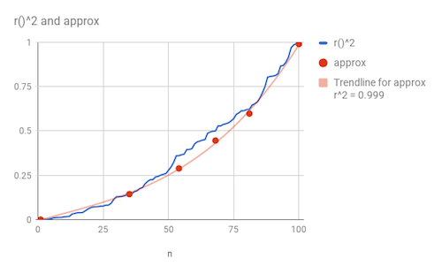

## Trust issues (with software)

Put your hand up if you are worried about the
increasing use of of
software (and especially data mining software) to control, well, everything; e.g.

- Nobel-prize winning chemists use software  [to make their discoveries](http://goo.gl/Lwensc); 
- Engineers use software to [designs many thing]( http://goo.gl/qBMyIZ)
  including optical tweezers, radiation therapy, remote sensing,  chip design;  
- Web analysts use software  to analyze clickstreams to [improve sales and marketing strategies](http://goo.gl/b26CfY);
- Stock traders write software to [simulate trading strategies](http://www.quantopian.com);
- Analysts write software  to mine   labor statistics data to [review proposed gov policies](http://goo.gl/X4kgnc);
- Journalists use software   to analyze economic data, make visualizations [of their news stories](http://fivethirtyeight.com);
- In London or New York,  ambulances wait for your call at a location [determined by a software model](http://goo.gl/8SMd1p).
- Etc etc etc  

In this century, much of what we can see and what we can do is selected and mediated and
controlled  and restricted by software.  This is a worry since
humans screw things up, [all the
time](https://en.wikipedia.org/wiki/List_of_cognitive_biases),
particualrly when [designing or building or using
software](http://seclists.org/risks/).
So how can we  trust  all that software?
How can
we tune it to our specific needs? How can we recognize when we should not use it?

## Trusting what we learn from data miners

In the general case of all softwware, I have little to say since "all software" is a very wide range of stuff.
But in the specific case of data mining software, there are very specific (and simple and general) things
we can do to increase the odds that person2 can critique and improve the models build my person1.

## What is Missing in Data Repositories?

Consider an operating system that can schedule processes, but has
no editors, compilers, file system, network support, ports, memory
management, gui, etc. Would you use that operating?

Now consider a data repository used by scientists stored data and
code in order to repeat/ confirm/ improve or even refute old results.
I think such repositories should do more than just support setting
and getting data, with (perhaps) some limited search interface. I
want my data repositories to be forums within which communitie can
curate, critique and even improve the conclusions drawn from data.

What would that extra layer of tools look like? 
Well there are many possible answers and the following are just some.
Students of this subject should be very critical of the following 
implementation ideas-- they are just one approach and they should
feel free to explore many more.

## The Elbow Test

A model passes the elbow test if, when displayed,
analysts are elbowed out of the way by
users in their haste to point to flaws on the display.

For this to work, models must be _readable_. Readable things are _NOT_ tediously long. There are many ways to reduce the size of a model:

- Unsuerpvised discretion: replace long list sof numbers
  with just a few `ranges`
### Unsupervised Discretization

Numeric ranges can be approxiated with a few  straight
line segments.

For example, suppose we sorted 100 numbers drawn from 
`R2`
where `R` is a random number drawn from 0..1 so 
`R2`  has a mean of about 0.25. 

As shown below, the red dots mark the verticies os a set
of points which, if connected with straight lines,
approximate that `R2` with a very high
correlation. 

These dots were found using the following rules

- Let the standard deviation of the whole population be _sd_;
- Let "epsilon" be _sd*0.5_ (which is one of [Cohen's rules](https://en.wikipedia.org/wiki/Effect_size#Cohen.27s_d))
     - Cohen defines small,medium,large to be sd*d_ where 
        _d &isin; \in (0.2,0.5,1)_. 
- Let "enough" numbers be the number of values, rasised to 0.5 
     - (which is one of [Webb's rules](); another of which is
       _enough=30_).
- Let the max and min value of each range be _&ge; epsilon_;
- Let the number of items in  a range be _&ge; enough_.
- Let the max value of one range be less than the min value
  of the next.

### Supervised Discretization

Suppose we are watching variable one to understand its
effect on variable two. Suppose further:

- we have used unsupervised
discretization to find ranges in variable one
- we find that variable two is very similar in some
  of the ranges of variable one
- then we could safely combine variable two ranges

apply unsupervised discretization to remove spurious numerics
2.  apply supervised discretization to combine

These days,
anyone can be a scientist (making generalizations from data)  by
just downloading a data mining toolkit, and running it over some data.

Now science is not just a way to build models, it is a way to evaluate
those models as well. Much of my work as a "sciencetist" is reviewing
papers, proposals, and the ideas of my colleagues.
So I say
it should be possible to audit the conclusions generated
in that way.
I 
want to  mistrust the conclusions of citizen scientists in
much the same way as I mustrust
ane explore , review, explore, evolve the conclusions of any other scientist. 

These days, anyone can act like a scientist- grab a data miner and build a model from data. But
should we trust the recommendations that come from such models? There are many examples of
people using data mining to arrive at misleading
conclusions or using models the wrong way (see Ekrem13](http://menzies.us/pdf/13distributed.pdf),  [Crateri13](https://ocw.mit.edu/courses/engineering-systems-division/esd-864-modeling-and-assessment-for-policy-spring-2013/projects/student-work/MITESD_864S13_NASA_Colbia.pdf)).

Standard scientific 
to generate bad models

Consider a table of data with rows and columns.
Let some rows be numeric and some symbolic 

- Numebrs are things we can add and sort. 
- Symbols are things we can only test for equal or not equal.

Some columns are independent variables and some are dependend

- Task: find combinations of the independent to predict values in the dependent.
- Prediction = there is onyl one dependent variable, and we have to guess what it might be:
   - Classification = one symbolic dependent variable. 
   - Regression = one numeric depedent variable
- Optimization =  N numeric dependents and we see ways to maximize, minize those values
   - Multi-objective optimization = N > 1
   - Many-objective optimization = N > 5

Somehow, cluster the rows into a dendogram (a tree of clusters and sub-clusters, etc).

For each leaf cluster, build a predictor (e.g. majority class or medium score in that leaf).

Feature selection

Instance selection
