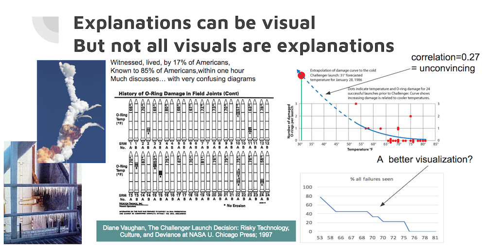
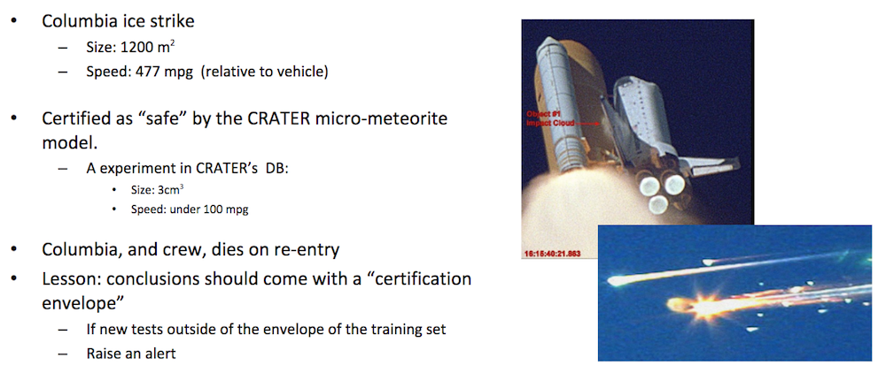

Bad data mining killed two space shuttles and over a dozen astronauts.

Lessons:

- Models kill
- Models should come with cerification envelopes and we should not use models outside of their training zone.
- Modeling method should match the data (carry a big toolbelt).

